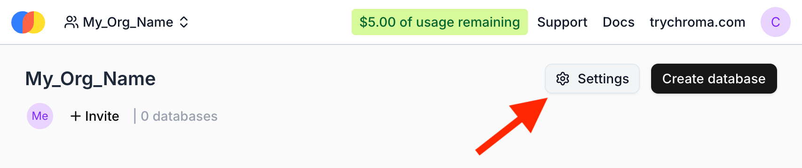
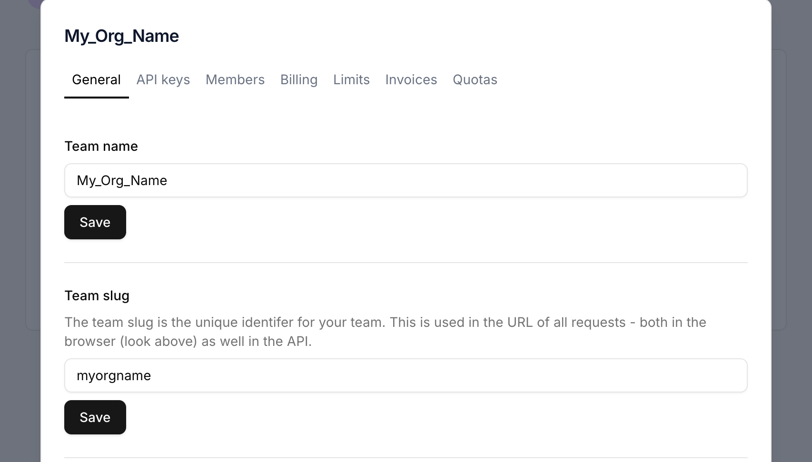
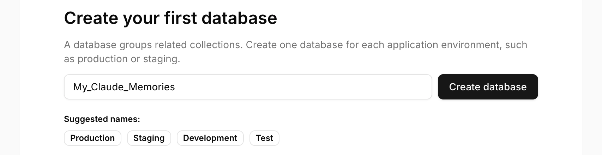
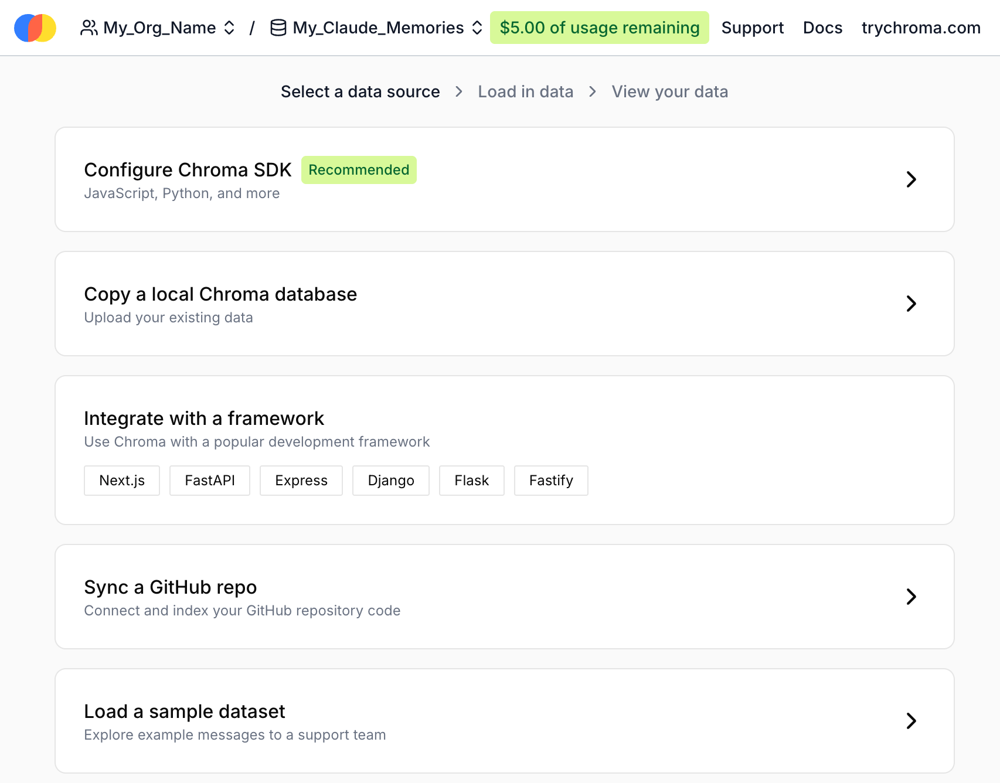
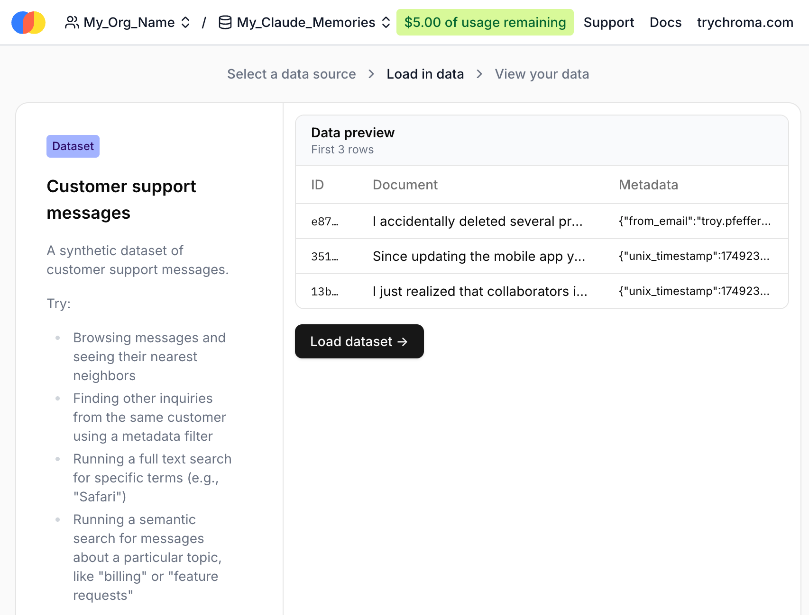
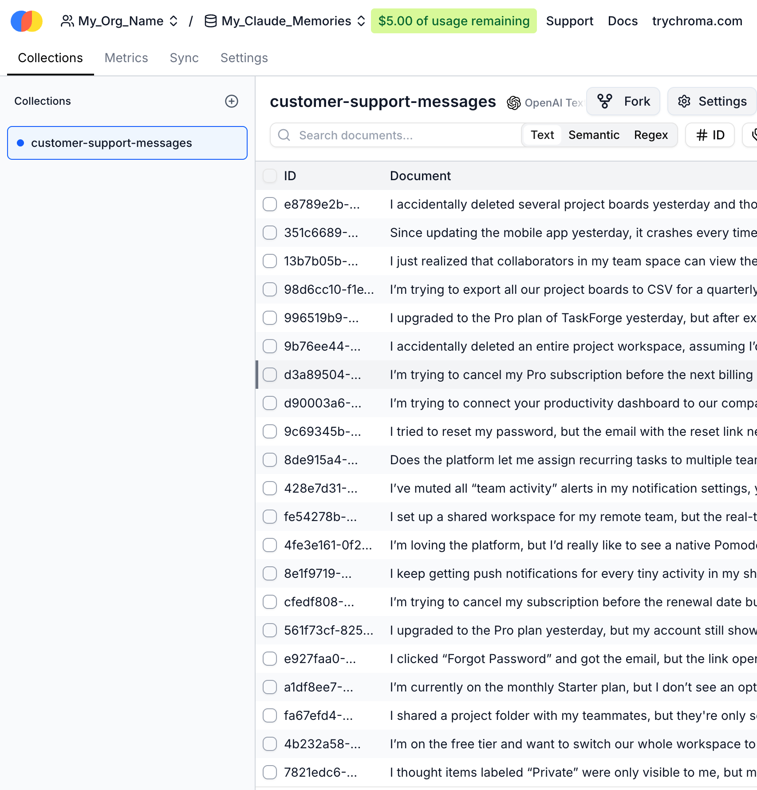

# Chroma Cloud Account Guide

Full guide to set up and configure Chroma Cloud account.

---

## ToC

1. [Starter Account](#starter-account)
2. [First login](#first-login)
3. [Organisation Settings](#organisation-settings)
4. [Organisation Name](#organisation-name)
5. [Database Creation](#database-creation)
6. [Empty Database](#empty-database)
7. [ChromaDB API Credentials](#chromadb-api-credentials)

---

## Starter Account

Chroma Cloud comes with three tiers of accounts:

1. Starter
2. Team
3. Enterprise

Register Starter account. It will come with $5 free credits that will let you run the memories database for few weeks.

Once you use all of the credits you can top-up your account. There's no monthly subscription only usage-based payment!

---

## First login

Once you log in for the first time you'll see something like this:

<details>
<summary>(CLICK ME)</summary>


</details>

---

## Organisation Settings

Click the Organisation Settings button to access your organisation configuration

<details>
<summary>(CLICK ME)</summary>



</details>

---

## Organisation Name

Adjust your Team Name to your liking. The Team slug is an url-friendly string that will be used in the URL.

<details>
<summary>(CLICK ME)</summary>



</details>

Adjust yout Team Name to your liking. The Team slug is an url-friendly string that will be used in the URL.

It is best to use alphanumeric characters: `A-Z`, `a-z` and `0-9`. If you wish to have a separator - use hyphens `-`

If your Team slug gets accepted - you'll immediately notice the page gets refreshed and your URL bar will reflect this.

Example: `https://www.trychroma.com/my-long-name-organisation-name`

---

## Database Creation

Time to create your first Database. Pick a name. This time you can use underscores `_` and hyphens `-` in the name.

> 🚨 **CAUTION!** 🚨
>
> You cannot change Chroma Database name later!

<details>
<summary>(CLICK ME)</summary>



</details>

## Empty Database

By default Chroma Cloud interface will ask you to feed this database with data. There are various ways however we will focus on the quickest and easiest one.

<details>
<summary>(CLICK ME)</summary>



</details>

Just select the last option - **[Load a sample dataset]**

On the next screen you will see what type of data will be loaded.

<details>
<summary>(CLICK ME)</summary>



</details>

Just hit the **[Load a sample dataset]** button.

And voila! You have sample collection in your first Chroma DB!

<details>
<summary>(CLICK ME)</summary>



</details>

It's 300 documents (records) in a collection.

---

## ChromaDB API Credentials

Notice that now you have on top menu with few options. The one we're interested in is **[Settings]** - click it!

On the very bottom you'll Python code snippet. Something like this:

```python
import chromadb

client = chromadb.CloudClient(
  api_key='YOUR_API_KEY',
  tenant='95a1b2c3-4e5f-6h7i-9j0k-12345abcd685',
  database='My_Claude_Memories'
)
```

Something missing, eh? Click the **[Create API key]** button and you'll get this:

```python
import chromadb

client = chromadb.CloudClient(
  api_key='ck-6UH7UmiqP8bLQhAqKSB8GsUJAgunskLeYPzgmE8GWD9w',
  tenant='95a1b2c3-4e5f-6h7i-9j0k-12345abcd685',
  database='My_Claude_Memories'
)
```

Much better! These are your credentials for this database. Save them!

We will use them for Yggdrasil's `.env` file.

### **Done!**
